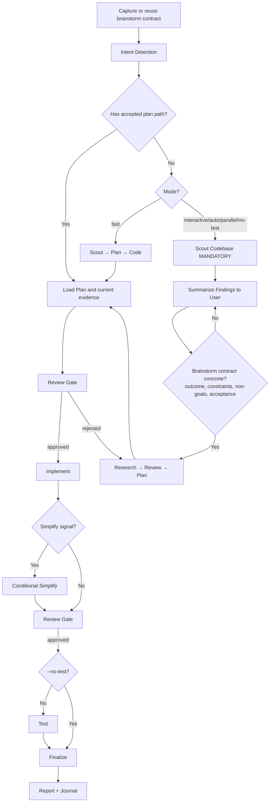

# Cook - Smart Feature Implementation

End-to-end implementation of known scope: a natural-language feature or an
accepted plan goes through a brainstorm contract, a mandatory scout, a reviewed
plan, implementation, delegated testing and review, and a finalize step that
syncs the plan, evaluates docs, commits, and journals. Does not handle concrete
bugs, failing tests, or CI failures — those go to `av:fix`, which proves the
root cause before choosing a solution.

**Principles:** KISS, DRY | Full requested scope, nothing extra (`--yagni` to opt into scope-cutting) | Token efficiency | Concise reports

## Usage

```
/av:cook <natural language task OR plan path> [mode flag] [composable flags]
```

| Flag | Effect |
| --- | --- |
| `--interactive` *(default when no flag)* | Full workflow; stops at every review gate for the user |
| `--fast` | Skip research: scout → plan → code; a plan step still runs |
| `--parallel` | Multi-agent execution with file ownership per agent |
| `--auto` | Skip the human review gates; implement every phase continuously |
| `--no-test` | Skip Step 4; the unverified-tests risk is put to the user at finalize |
| `--tdd` | Tests-first per phase: write tests for current behavior, implement, verify they still pass |
| `--advice` | Run under `kongming` advisory supervision — read `references/advisory-supervision.md` for the checkpoints and the PR handoff |
| `--yagni` | Opt into YAGNI: challenge and cut scope not needed for the stated outcome. Default is the full requested scope |
| `--skip-journal` | Skip the automatic journal entry at finalize |

The first five select a mode; the rest compose with any mode. A plan path
(`plan.md` or `phase-*.md`) selects `code` mode, which executes the plan as is.
```
/av:cook "Add user authentication to the app" --fast
/av:cook path/to/plan.md --auto
/av:cook "Refactor auth middleware" --tdd
```

<HARD-GATE-BRAINSTORM-FIRST>
Before planning or implementation, capture the opening brainstorm contract:
outcome, constraints, non-goals, and observable acceptance criteria.

- If the input is an accepted plan or design, reuse those fields and identify
  only material gaps.
- If the input is a natural-language task, state the fields from the request and
  ask only about a missing decision that would change the result or safety.
- `--fast`, `--parallel`, and `--auto` change execution shape, not this gate.
- Route concrete bugs to `av:fix`; it frames intent first, then proves the root
  cause before selecting a solution.
</HARD-GATE-BRAINSTORM-FIRST>

<HARD-GATE>
Do NOT write implementation code until a plan exists and has been reviewed.
This applies regardless of task simplicity. "Simple" tasks are where unexamined assumptions waste the most time.
Exception: `--fast` mode skips research but still requires a plan step.
User override: If user explicitly says "just code it" or "skip planning", respect their instruction.
</HARD-GATE>

<HARD-GATE-SCOUT-FIRST>
After the opening brainstorm gate and before planning, scan the codebase.
Mandatory scout outputs:
1. Project type, language(s), framework(s)
2. Existing modules/files relevant to the task
3. Current patterns/conventions for similar features (so the implementation matches them)
4. Existing docs in `./docs/` and any in-flight plans in your configured plans dir (`plans/` by default) covering this area
5. Public APIs, schemas, contracts that the task could affect

State a concise codebase-context summary before asking any further questions.
Skip only when an accepted plan already contains current scout evidence.
</HARD-GATE-SCOUT-FIRST>

<HARD-GATE-EXACT-REQUIREMENTS>
Before producing a plan, the brainstorm contract must be concrete and scout
evidence must identify likely touchpoints and stable public contracts. Ask only
for a material requirement that neither the request, accepted plan, nor current
evidence resolves. Ground questions in discovered paths and behavior.
</HARD-GATE-EXACT-REQUIREMENTS>

<HARD-GATE-NO-SIDE-EFFECTS>
Implementation is NOT done until verified to be side-effect-free. Code-review and test gates MUST prove:

1. New behavior matches every acceptance criterion above.
2. All tests pass — including tests in modules that share files/contracts with the change.
3. No existing business logic / workflow regression: explicitly walk each touchpoint and any caller of changed functions.
4. No new lint/type/build errors anywhere in the repo.
5. Public contracts unchanged unless intentional and called out (function signatures, exported types, API responses, DB schemas, env vars, config keys).

User override: If user invoked `--no-test`, item 2 is downgraded to a warning. Surface the unverified-tests risk in the finalize `ask_user capability` so the user accepts the trade-off rather than having it silently chosen. Items 1, 3, 4, 5 remain enforceable via the mandatory `code-reviewer` subagent.

If review/testing reveals a side effect, regression, or broken workflow, STOP. Use `ask_user capability` to present:
- What broke (file, test, workflow, user-facing behavior)
- Why this implementation caused it (1-line cause)
- 2-4 concrete options for the user to choose, e.g.:
  - "Revert this slice and re-plan with stricter scope"
  - "Keep the implementation and update <dependents> to match the new contract"
  - "Add a compatibility shim at <boundary> so old callers keep working"
  - "Accept the regression — old behavior was unintended/buggy"

Let the user decide. Do not silently patch around regressions.
</HARD-GATE-NO-SIDE-EFFECTS>

## Intent detection

Without an explicit flag, the mode comes from the input: a plan path → `code`;
"fast"/"quick" → `fast`; "trust me"/"auto" → `auto`; three or more listed
features or "parallel" → `parallel`; "no test"/"skip test" → `no-test`;
otherwise `interactive`. `references/intent-detection.md` carries the
priority order, feature extraction, and the per-mode behavior table. When the
task needs a cross-skill sequence decision after detection, load
`references/workflow-routing.md`. When tempted to skip the plan step, read
`references/anti-rationalization.md` first.

## Process Flow (Authoritative)



**This diagram is the authoritative workflow.** If prose conflicts with it, follow the diagram.

## Workflow Overview

Step numbering, used by every marker below: 0 contract + mode · 1 research ·
2 plan · 3 implement (3.S conditional simplify) · 4 test · 5 code review ·
6 finalize. `references/workflow-steps.md` carries each step's per-mode detail
and `references/intent-detection.md` the per-mode table (which steps run,
which gates stop). Only `auto` skips the human review gates.

**Progress tracking:** Discover the live task-management surface at runtime and use it when
available; otherwise update the active plan directly. Plan files are the durable source of truth.

**Plan resolution (files-first):** when the input is a plan path or an existing
plan is in scope, read it with `av plan resolve` (the directory) or `av plan
show` (the phases). Both answer for the current branch's pointer only and exit
non-zero when it has none — that means "no plan", not an error; set the pointer
with `av plan use <name>`. Mutate status only through `av plan status` (the
plan) and `av plan update <phase> <status>` / `check` / `uncheck` (a phase) —
never from GitHub issue comments, and never require a linked issue to resolve or
progress a plan. See `references/plan-state-files-first.md` for the full model.

## Blocking Gates (Non-Auto Mode)

Human review required at these checkpoints (skipped with `--auto`):
**Post-Research** (findings before planning) · **Post-Plan** (approve before
implementation) · **Post-Implementation** (approve before testing) ·
**Post-Testing** (100% pass + approve before finalize).

**Always enforced (all modes):**
- **Testing:** 100% pass required (unless no-test mode)
- **Code Review (MANDATORY):** Spawn `code-reviewer` with the five explicit
  checks (acceptance criteria met · no regression in the blast radius · no
  uncalled-out public-contract break · follows scouted patterns · no new
  lint/type/build errors) and the scout summary + acceptance criteria as
  context — the exact prompt is in `references/subagent-patterns.md`. A
  flagged side effect triggers HARD-GATE-NO-SIDE-EFFECTS. Then: user approval,
  or the auto-mode decision in `references/review-cycle.md`.
- **Finalize (MANDATORY - never skip):**
  1. **Activate `av:pm` (MANDATORY)** → run full plan sync-back across ALL `phase-XX-*.md` (not only current phase), update `plan.md` status/progress, refresh runtime tracking when available, generate progress report
  2. Evaluate docs impact; use `docs-manager` only for affected routed authority surfaces
  3. After sync-back verification, reflect completion in the live task-management surface when available
  4. Ask user if they want to commit via `git-manager` subagent
  5. Run `av:journal` to write a concise technical journal entry upon completion — unless the journal opt-out below applies.

### Journal step — opt-out

Skip the automatic `av:journal` step only when the invocation includes the
`--skip-journal` flag, and print one line: `journal skipped by --skip-journal`.
There is no config switch for it: `av config prefs resolve --json` has no
`journal` key, and an unknown key in either config file is warned about and
ignored, so no setting can suppress the step. Explicit `av:journal` and
`av journal create` are unaffected. The rest of the Finalize block above stays
MANDATORY.

## Required Subagents (MANDATORY)

`references/subagent-patterns.md` lists the subagent per phase and the exact
prompts. `tester` (plus `debugger` on failure), `code-reviewer`, and
`git-manager` are never optional; the rest are optional only in modes that
skip their step.

**CRITICAL ENFORCEMENT:**
- Steps 4, 5, 6 **MUST** use the live delegation capability to spawn subagents
- DO NOT implement testing, review, or finalization yourself - DELEGATE
- If workflow ends without the required delegations, it is INCOMPLETE
- Pattern: `delegate_agent capability(subagent_type="[type]", prompt="[task]", description="[brief]")`
- If the user passed `--yagni`, include it in every subagent prompt and downstream
  skill call so the opt-in survives the handoff; without it a delegate delivers the full requested scope.

## Output format

One marker line per step, in the numbering above, as the step completes:
```
✓ Step [N]: [Brief status] - [Key metrics]
⏸ Step [N]: [Brief status] - WAITING for approval     ← at a review gate, non-auto modes only
```

The closing report, after Step 6, in chat:
```
Cook complete: <task or plan path>
  Mode:     <interactive|auto|fast|parallel|no-test|code>
  Phases:   <done>/<total> (or "no plan" for an ad-hoc task)
  Files:    <N changed>
  Tests:    <X/X passed | skipped (--no-test, risk accepted by user)>
  Review:   <score>/10 - <user approved|auto-approved|approved with noted issues>
  Plan:     <plan-dir> status <pending|in-progress|completed> (or "no plan")
  Docs:     <paths updated | no authority surface changed>
  Commit:   <sha | not committed (user declined)>
  Journal:  <entry path | skipped by --skip-journal>
```

Every field comes from a step that ran — Review from the `code-reviewer` score, Plan from the `av:pm` sync-back, Commit from `git-manager`.

## Quality gates

- [ ] A plan existed and was reviewed before the first implementation edit —
      in `--fast` too; the only exits are the user's explicit "just code it"
      and `code` mode, where the accepted plan is the reviewed plan
- [ ] The brainstorm contract was stated or reused before scouting, and every
      acceptance criterion in it appears verbatim in the `code-reviewer` prompt
- [ ] Steps 4, 5, 6 were delegated (`tester`, `code-reviewer`, `git-manager`)
      and `av:pm` was activated at finalize — a workflow that ends with zero
      delegations is incomplete
- [ ] Plan state changed only through `av plan update` / `check` / `uncheck`
      (a phase) and `av plan status` (the plan); no frontmatter was hand-edited
      while `av` was available, and no invented subcommand was run
- [ ] Under `--no-test`, the finalize `ask_user capability` named the
      unverified-tests risk and the user accepted it; under `--yagni`, the flag
      reached every subagent prompt and downstream skill call
- [ ] A reviewer- or test-flagged side effect stopped the workflow and went to
      the user with 2-4 options; nothing was patched around

## Workflow position

**Typically follows:** `av:plan`, whose `plan.md` and phase files this skill
executes in `code` mode (the `cook-after-plan-reminder` hook prints the
`/av:cook <plan.md>` handoff after a plan is written); `av:brainstorm`, whose
accepted contract becomes the opening one; `av:agentize`, which hands its
remaining implementation here.

**Typically precedes:** `av:ship`, once finalize has synced the plan and the
branch is ready for a PR; `av:journal` runs at finalize unless skipped.

**Invokes directly:** `av:scout` for the mandatory codebase scan; `av:plan`
(`--fast`, `--parallel`, `validate`) when planning happens inside the workflow;
`av:pm` for the finalize sync-back; `av:journal` at finalize.

**Related:** `av:fix` owns concrete bugs, failing tests, and CI failures —
route them there instead of cooking a patch. `av:vibe` wraps this skill in its
issue-to-PR pipeline. `av:test` and `av:code-review` are standalone skills;
here their work is done by the `tester` and `code-reviewer` subagents.

## References

- `references/intent-detection.md` - Detection rules and routing logic
- `references/workflow-routing.md` - Cross-skill sequence routing for ambiguous workflows
- `references/workflow-steps.md` - Detailed step definitions for all modes
- `references/review-cycle.md` - Interactive and auto review processes
- `references/subagent-patterns.md` - Subagent invocation patterns
- `references/advisory-supervision.md` - `--advice` checkpoints and the PR handoff
- `references/plan-state-files-first.md` - Canonical plan-file model, what each `av plan` command reads and writes, and optional GitHub projection
- `references/anti-rationalization.md` - The excuses for skipping the plan step, answered
