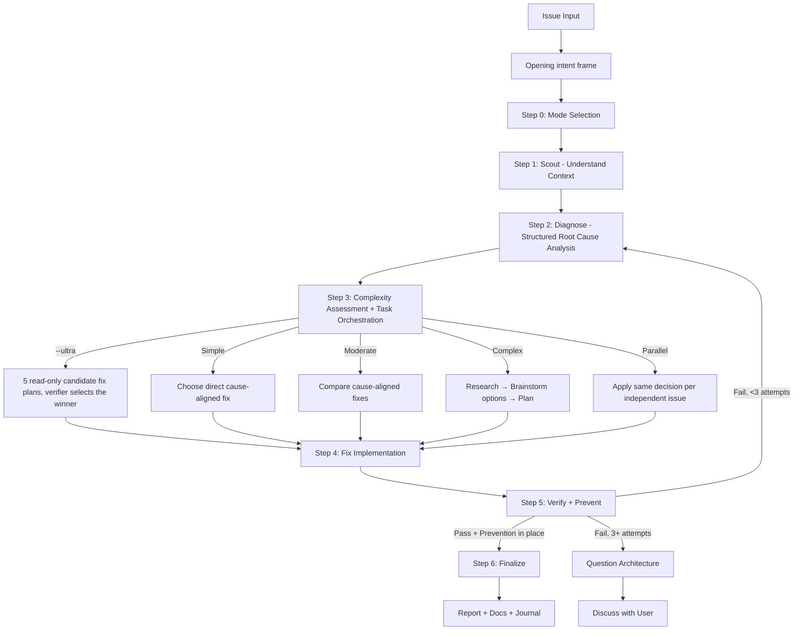

# Fixing

Repair a concrete, reproducible failure of any complexity: frame the intended
outcome, scout the affected code, prove the root cause with evidence, route by
complexity to a quick, standard, deep, or parallel workflow, implement the cause-aligned
fix, then verify it against the captured pre-fix state and add the regression guard.
Does not handle new feature scope (`av:cook`) or a diagnosis-only request with no repair (`av:debug`).

## Arguments

| Flag | Effect |
| --- | --- |
| `--auto` *(default)* | Autonomous: auto-approve when the review score is ≥ 9.5 with 0 critical findings |
| `--review` | Human-in-the-loop: pause for approval at each major step |
| `--quick` | Fast scout → diagnose → fix → verify cycle for trivial issues (lint, type errors) |
| `--parallel` | Route 2+ independent issues to parallel `fullstack-developer` agents, one scope each |
| `--ultra` | Run the post-diagnosis fix-plan selection (Step 3) as a best-of-5 verifier pass — read `references/complexity-assessment.md` → "Ultra Verifier Mode"; hard-conflicts with `--quick` and `--parallel` |
| `--advice` | Run under `kongming` advisory supervision — read `references/advisory-supervision.md` |
| `--skip-journal` | Skip the automatic journal entry at finalize |

<HARD-GATE-BRAINSTORM-FIRST>
Begin with a bounded intent frame before mode selection or diagnosis —
**Outcome** (the expected repaired behavior), **Constraints** (safety,
compatibility, ownership, time), **Non-goals** (adjacent behavior this fix must
not absorb), **Acceptance criteria** (the reproduction and broader evidence that
will prove the repair complete). Reuse these fields from an accepted plan when
available. This gate does not choose a fix: scout and diagnose the root cause
before comparing solution options.
</HARD-GATE-BRAINSTORM-FIRST>

<HARD-GATE>
Do NOT propose or implement fixes before completing Steps 1-2 (Scout + Diagnose).
Symptom fixes are failure. Find the cause first through structured analysis, NEVER guessing.
If 3+ fix attempts fail, STOP and question the architecture — discuss with user before attempting more.
User override: `--quick` mode allows fast scout→diagnose→fix cycle for trivial issues (lint, type errors).
</HARD-GATE>

<HARD-GATE-SCOUT-FIRST>
After the opening intent frame, scan the codebase before forming hypotheses or
asking solution-oriented questions. Mandatory scout outputs (collect before
diagnosis):
1. Project type, language(s), framework(s) — from package.json/pyproject.toml/go.mod/etc.
2. The exact file(s) where the symptom surfaces + their direct callers/dependents
3. Related tests covering the affected area
4. Recent commits (`git log --oneline -20`) touching scouted files — possible introducer
5. Existing patterns/conventions for this kind of code (so the fix matches them)

State a concise codebase-context summary before asking for missing diagnostic
evidence.
</HARD-GATE-SCOUT-FIRST>

<HARD-GATE-EXACT-ROOT-CAUSE>
Do NOT propose a fix until you can answer ALL of these in one concrete sentence each:

1. **Exact symptom**: precise error message / failing assertion / observed behavior (copy verbatim, not paraphrased).
2. **Reproduction steps**: minimal sequence that triggers it (commands, inputs, environment).
3. **Expected vs actual**: what SHOULD happen vs what DOES happen.
4. **Root cause** (not symptom): the underlying defect — a specific line, missing check, race condition, contract violation, or design flaw. Cite file:line evidence.
5. **Why now**: what change/condition exposed it (recent commit, data shape, env, dep upgrade).
6. **Blast radius**: every code path that depends on the broken behavior or shares the same root cause.

If ANY item is vague ("probably", "I think", "something with…"), use `ask_user capability` to gather missing facts (logs, repro, env) OR run more scout/debug — never guess.

Use `ask_user capability` with options grounded in scout findings (specific files, specific commits, specific functions) — never abstract.
</HARD-GATE-EXACT-ROOT-CAUSE>

<HARD-GATE-NO-SIDE-EFFECTS>
The fix is NOT done until verified to be side-effect-free. Step 5 MUST prove:

1. Original symptom no longer reproduces (re-run exact pre-fix repro from Step 2).
2. All tests in modified files + transitively-affected modules pass.
3. No business logic / workflow regression in the **blast radius** identified above (run those tests too, or manually walk the affected flows).
4. No new lint/type/build errors introduced anywhere.
5. Public API contracts (function signatures, exported types, response shapes, DB schemas, env vars) unchanged — OR change is intentional and called out.

If verification reveals a side effect, regression, or broken workflow, STOP. Do NOT silently patch around it. Use `ask_user capability` to present what broke (file, test, workflow), why the fix caused it (1-line cause), and 2-4 concrete options, e.g. "Revert the fix and try a different root-cause angle" / "Keep the fix and update the dependent code at <files> to match the new contract" / "Narrow the fix scope to <subset> so the regression goes away" / "Accept the regression — it was buggy behavior the test was locking in". Let the user decide. Do not assume.
</HARD-GATE-NO-SIDE-EFFECTS>

When tempted to skip Steps 1-2 or try "one more" patch, read `references/anti-rationalization.md` first.

## Process Flow (Authoritative)



**This diagram is the authoritative workflow.** If prose conflicts with it, follow the diagram.
## Workflow

### Step 0: Intent Frame & Mode Selection

First capture or reuse the opening outcome, constraints, non-goals, and
acceptance criteria. If the mode is neither explicit nor safely inferable, use
`ask_user capability` to choose between Autonomous (simple/moderate issues),
Human-in-the-loop (critical or production code), and Quick (type errors, lint,
trivial bugs) — the question format, the per-issue recommendation, and when to
skip the question are in `references/mode-selection.md`.

### Step 1: Scout (MANDATORY — never skip)

Understand the affected codebase BEFORE forming hypotheses: activate `av:scout`
or, when delegation was requested and permitted, 2-3 parallel `Explore`
subagents. Collect the five HARD-GATE-SCOUT-FIRST outputs; read unfamiliar `docs/`.
Quick mode scouts only the affected file(s) and their direct dependencies;
Standard/Deep map module boundaries, test coverage, and call chains.

### Step 2: Diagnose (MANDATORY — never skip)

Structured root cause analysis, evidence-based only — HARD-GATE-EXACT-ROOT-CAUSE
is the protocol:
1. **Capture pre-fix state:** exact error messages, failing test output, stack traces, log snippets — the baseline Step 5 re-runs.
2. Activate `av:debug` (systematic-debugging + root-cause-tracing), then `av:sequential-thinking` to form hypotheses through structured reasoning.
3. Test each hypothesis against codebase evidence; use parallel `Explore`
   subagents only when delegation was explicitly requested and permitted. If
   2+ hypotheses fail, auto-activate `av:problem-solving`.
4. Write the diagnosis report: confirmed root cause, evidence chain, affected scope.

### Step 3: Complexity Assessment & Progress Orchestration

Classify before routing. See `references/complexity-assessment.md`.

| Level | Indicators | Workflow |
|-------|------------|----------|
| **Simple** | Single file, clear error, type/lint | `references/workflow-quick.md` |
| **Moderate** | Multi-file, root cause unclear | `references/workflow-standard.md` |
| **Complex** | System-wide, architecture impact | `references/workflow-deep.md` |
| **Parallel** | 2+ independent issues OR `--parallel` flag | Parallel `fullstack-developer` agents |

**Progress orchestration (Moderate+ only):** record all phases and their
dependencies upfront — in the live task-management surface when available,
otherwise in the active plan; one dependency tree and ownership scope per
issue in Parallel. Skip for Quick. Plan files are the durable source of truth;
runtime tracking is never required for the fix to proceed.

Select a solution only from the confirmed diagnosis: for one safe, direct
repair, record why it satisfies the opening contract; for multiple viable
repairs or an architecture decision, activate `av:brainstorm`, compare
trade-offs, and resolve the direction before implementing. Deep always
includes this brainstorm and a plan; Quick and Standard escalate to Deep when
the choice is not direct.

### Step 4: Fix Implementation

Implement per the selected workflow, updating progress as phases complete. Fix
the ROOT CAUSE the diagnosis named, not the symptom; minimal changes that
follow existing patterns; preserve the opening non-goals and constraints — do
not widen the fix while addressing nearby symptoms.

### Step 5: Verify + Prevent (MANDATORY — never skip)

**Purpose:** Prove the fix works, has NO side effects, and prevents the same bug class from recurring. See HARD-GATE-NO-SIDE-EFFECTS.

1. **Verify (iron-law):** Run the EXACT commands from pre-fix state capture. Compare output. NO claims without fresh evidence.
2. **Regression test:** Add or update test(s) that specifically cover the fixed issue. The test MUST fail without the fix and pass with it.
3. **Side-effect sweep:** Run tests across the full **blast radius** identified in Step 2 (not just the modified file). Walk each dependent code path. Confirm public contracts unchanged (signatures, response shapes, DB schemas, env vars).
4. **Code review:** When delegation was requested and permitted, spawn
   `code-reviewer`; otherwise review locally. Check root cause, blast radius,
   failure modes, and scouted patterns, then follow `references/review-cycle.md`.
5. **Prevention gate:** Apply defense-in-depth validation where applicable.
6. **Parallel verification:** Run typecheck + lint + build + test with `run_shell`; split across delegated workers only when delegation is permitted (`references/parallel-exploration.md`).

**On a side effect:** `ask_user capability` per HARD-GATE-NO-SIDE-EFFECTS — what broke, why, 2-4 options (revert, narrow scope, update dependents, accept); never silently patch. **On a failed verification:** loop back to Step 2 and re-diagnose; after 3 failures, question the architecture with the user.

### Step 6: Finalize (MANDATORY — never skip)

1. Print the closing report (shape under **Output format**)
2. **Activate `av:pm` (MANDATORY)** → sync plan status (if the fix is part of a plan), update progress, refresh runtime tracking when available, generate status report
3. Evaluate docs impact; use `docs-manager` only when a routed authority surface changed
4. Reflect completion in the live task-management surface when available
5. Ask user if they want to commit via `git-manager` subagent
6. Run `av:journal` to write a concise technical journal entry upon completion — unless the journal opt-out below applies.

### Journal step — opt-out

Skip the automatic `av:journal` step only when the invocation includes the
`--skip-journal` flag, and print one line: `journal skipped by --skip-journal`.
There is no config switch for it: `av config prefs resolve --json` has no
`journal` key, and an unknown key in either config file is warned about and
ignored, so no setting can suppress the step. Explicit `av:journal` and
`av journal create` are unaffected. The rest of the Finalize block above stays
MANDATORY.

## Skill and subagent activation

`references/skill-activation-matrix.md` is the complete matrix. The
non-negotiables in every workflow: `av:scout` (Step 1), `av:debug` and
`av:sequential-thinking` (Step 2), independent review in Step 5 (delegated when permitted), and `av:pm` (Step 6);
`av:problem-solving` when 2+ hypotheses fail; `av:brainstorm` when more than
one cause-aligned repair remains.

## Output format

Steps 0-3 print one unified marker each as they complete:
```
✓ Step 0: Intent framed; [Mode] selected
✓ Step 1: Scouted - [N] files, [M] deps, [K] tests found
✓ Step 2: Diagnosed - Root cause: [summary], Evidence: [brief], Scope: [N files]
✓ Step 3: [Complexity] detected - [workflow] selected
```
From Step 4 on, the routed workflow file owns the markers and prints its own
numbering as written there (Quick 1-6, Standard 1-6, Deep 1-9; in Parallel,
each `fullstack-developer` agent reports its own issue's markers). After the
routed file's Finalize step, print the closing report in chat:
```
Fix complete: <issue>
  Mode / workflow:  <autonomous|review|quick> / <quick|standard|deep|parallel>
  Root cause:       <one sentence, file:line> — why now: <introducing change>
  Changes:          <N files> — <paths>
  Verified:         <exact pre-fix command> → before: <output> / after: <output>
  Regression test:  <test path | type system is the test (quick, type/lint only)>
  Blast radius:     <N dependent paths walked, tests run | clean>
  Review:           <score>/10 - <auto-approved|user approved|approved with noted issues>
  Prevention:       <guards added | none needed — reason>
  Plan sync:        <plan-dir> status <…> (or "not part of a plan")
  Commit:           <sha | not committed (user declined)>
  Journal:          <entry path | skipped by --skip-journal>
```
Every field is filled from a step that ran; "Verified" always shows both runs of the same command, never a paraphrase.

## Quality gates

- [ ] The six root-cause answers (verbatim symptom, repro, expected vs actual,
      cause at file:line, why now, blast radius) were written before the first
      edit, and none contains "probably", "I think", or "something with"
- [ ] Pre-fix state was captured as an exact command plus its output, and the
      same command was re-run after the fix — the report shows both outputs
- [ ] A regression test fails without the fix and passes with it, except in a
      Quick type/lint-only fix, where the report says the type system is the test
- [ ] Tests ran across the Step 2 blast radius, not only the modified file, and
      public contracts are unchanged or the change is called out in the report
- [ ] Failed attempts were counted: after the third, the workflow stopped and
      put the architecture question to the user instead of trying a fourth
- [ ] `code-reviewer` received the diagnosis report and scout summary; any side
      effect it flagged went to the user with 2-4 options, never patched around

## Workflow position

**Typically follows:** `av:debug`, which hands over a proven diagnosis and
names the validation layers this skill writes; `av:scout`, when the failing
code was located first; `av:cook`, which routes concrete bugs here instead of
cooking a patch; `av:review-pr --fix` and `av:git` merge recovery, which hand
review findings or a CI failure to `av:fix --auto`.

**Typically precedes:** `av:git` or the `git-manager` subagent for the commit,
`av:ship` when the fix is its own branch, and `av:journal` at finalize.

**Invokes directly:** `av:scout` (Step 1); `av:debug`, `av:sequential-thinking`,
`av:problem-solving` (Step 2); `av:brainstorm` (Step 3); `av:pm` (Step 6).

**Related:** `av:test` and `av:code-review` run standalone after a fix; here they are Step 5. `av:vibe` wraps this skill for its bugfix route; `av:ui-ux-pro-max` backs the UI workflow's style searches.

## References

| Read when | File |
| --- | --- |
| Step 0 needs the mode question | `references/mode-selection.md` |
| Step 3 classifies the issue, or `--ultra` was passed | `references/complexity-assessment.md` |
| Routed Simple / Moderate / Complex | `references/workflow-quick.md` / `references/workflow-standard.md` / `references/workflow-deep.md` |
| Handling the `code-reviewer` result | `references/review-cycle.md` |
| Deciding which skill or subagent a step activates | `references/skill-activation-matrix.md` |
| Delegating scout, hypothesis, or verification work | `references/parallel-exploration.md` |
| `--advice` was passed | `references/advisory-supervision.md` |
| Tempted to patch a symptom | `references/anti-rationalization.md` |
| The failure is in CI / logs / a test suite / TS types / the UI | `references/workflow-ci.md` / `references/workflow-logs.md` / `references/workflow-test.md` / `references/workflow-types.md` / `references/workflow-ui.md` |
