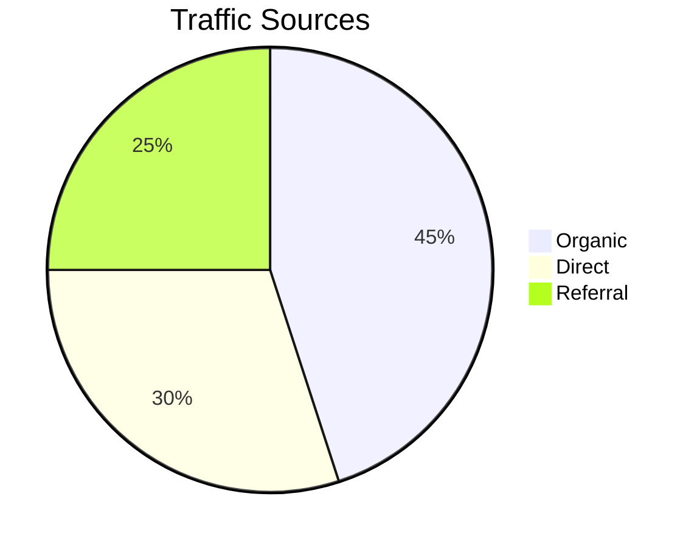
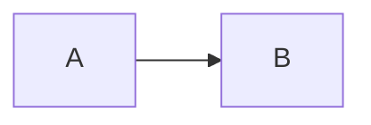
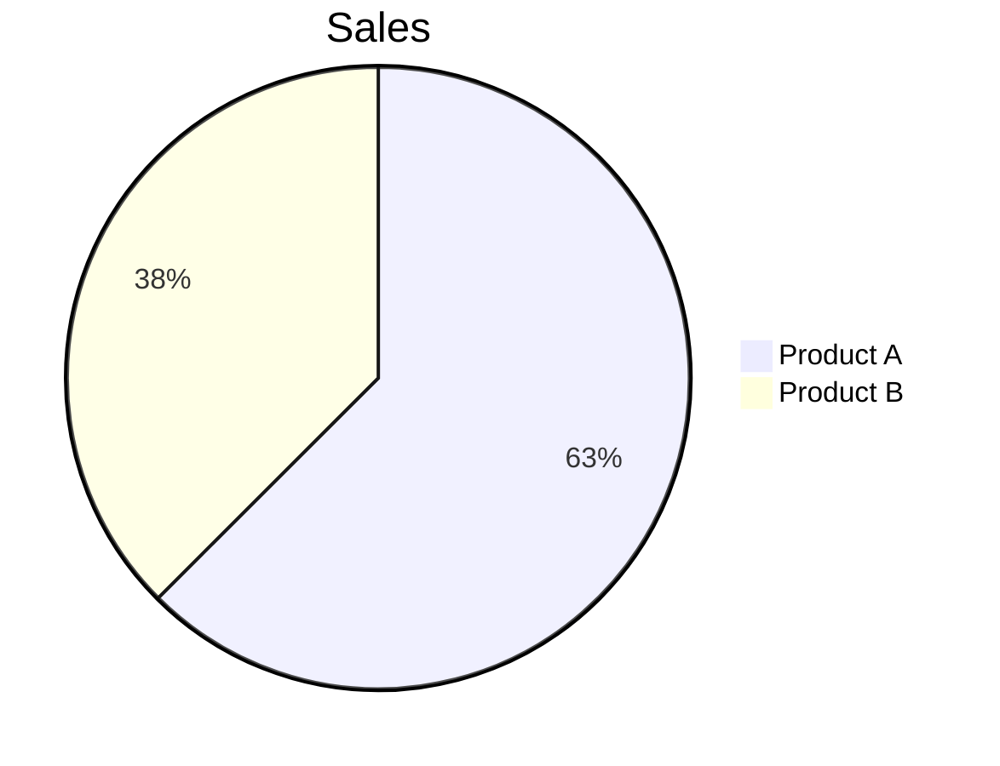
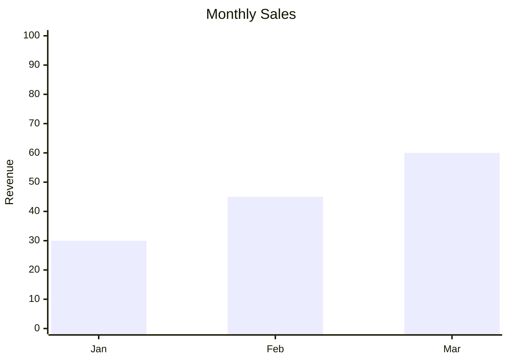
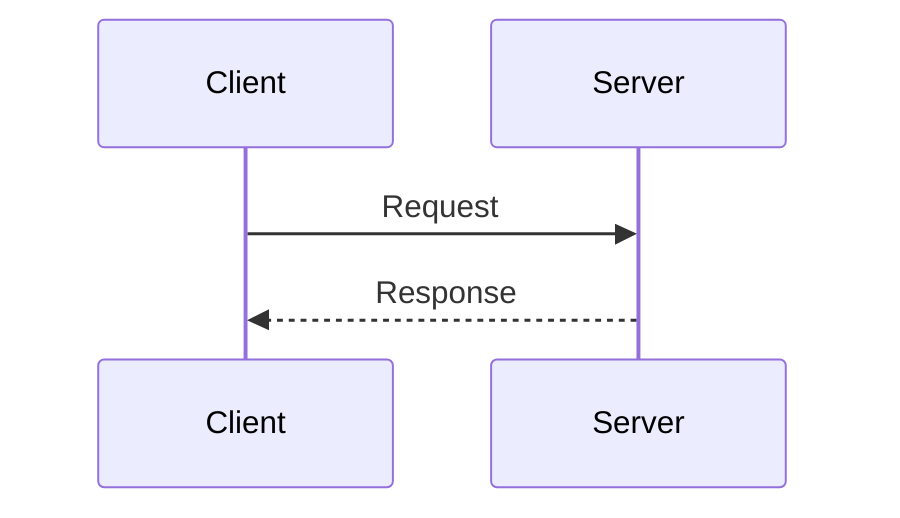

# Mermaid Diagrams in the Viewer

Read when a document you are serving contains (or should contain) `mermaid`
fenced blocks, or when a diagram fails to render.

## How rendering works

`scripts/lib/markdown-renderer.cjs` turns every ```` ```mermaid ```` block into
a `<div>` carrying the escaped source; `assets/template.html` loads Mermaid 11
from `cdn.jsdelivr.net` as an ES module and `assets/reader.js` renders the
blocks client-side. Rendering therefore needs network access from the browser;
the server itself never contacts the CDN.

## Usage

Use fenced code blocks with the `mermaid` language:

````markdown

````

## Supported diagram types

| Type | Syntax | Use Case |
|------|--------|----------|
| Flowchart | `flowchart LR/TB/TD` | Process flows, decision trees |
| Sequence | `sequenceDiagram` | API interactions, message flows |
| Pie | `pie title "..."` | Distribution data |
| Gantt | `gantt` | Project timelines |
| XY Chart | `xychart-beta` | Bar/line charts |
| Mindmap | `mindmap` | Idea hierarchies |
| Quadrant | `quadrantChart` | 2x2 matrices |

## Validating snippets

**Quick validation**: paste the block into the [Mermaid Live Editor](https://mermaid.live).

**Common errors and fixes**:

| Error | Cause | Fix |
|-------|-------|-----|
| `Parse error` | Invalid syntax | Check diagram type declaration |
| `Unknown diagram type` | Typo in declaration | Use exact type: `flowchart`, not `flow` |
| `Expecting token` | Missing quotes/brackets | Ensure balanced delimiters |
| `UnknownDiagramError` | Empty or malformed block | Add valid diagram content |

## Fixing common issues

**1. Flowchart arrows**


**2. Pie chart values**


**3. XY Chart data format**


**4. Sequence diagram participants**


## Debug mode

When a diagram fails to render, `reader.js` replaces it inline with
**Mermaid Error:**, the error message Mermaid threw (which names the line
when the parser reports one), and a collapsed **Source** block with the
original code. Fix the syntax and refresh the page to re-render.
