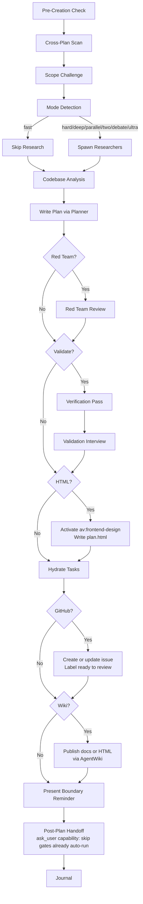

# Planning

Create detailed technical implementation plans through research, codebase analysis, solution design, and comprehensive documentation. Produces plan files only; implementation belongs to `av:cook`, and keeping the files truthful afterwards belongs to `av:pm`.

## Plan files and the CLI

**Files-first:** `plan.md` + `phase-NN-*.md` under `<timestamp>-<slug>/` in your
configured plans dir (`plans/` by default; `paths.plans` in
`.ariadnev/config.json` overrides it) ARE the plan — hand-editable Markdown, the
deliverable of this skill, and the only thing implementation skills read. The
CLI can bootstrap them; the agent fills them.

`av plan` scaffolds and tracks those files — it is not an index and keeps no
database. Its subcommands are `use | show | create | add-phase | kanban | parse
| validate | migrate | list | resolve | update | check | uncheck | status |
close | phase | search | reindex | archive | cleanup`. Before any mutation, run
`av plan --help`, then the chosen subcommand's `--help` — those live surfaces
own names, arguments, and flags; never copy their syntax into a plan. `av plan
create <title>` bootstraps the plan directory from the template (`--description`,
`--priority`, `--use` to also point this branch at it); `av plan add-phase
<title>` appends the next `phase-NN-<slug>.md` stub plus its table row
(`--plan`, `--depends`). `validate` checks one plan's directory format and
exits 1 when invalid; `reindex` re-reads every plan and reports what is
malformed — there is nothing to rebuild.
A GitHub issue is an optional visibility projection the agent publishes with
`gh`, never required and never canonical. `av` is not required to plan — the
files are still the plan without it — but every subcommand above is, including
the `av plan list` the cross-plan scan below uses; fall back to reading
`plans/*/plan.md` frontmatter directly.

Rules:
- Write plan content as files; set a phase's status with `av plan update
  <phase> <status>` (or `check`/`uncheck`) so the phase file and the index table
  change together — the `plan-format-kanban` hook warns on a hand-edited cell.
- One sequence: scaffold (`av plan create <title> --use`, then `av plan
  add-phase` per phase) → read pass → fill → and if `--use` was not passed at
  create time, `av plan use <plan-dir-name>` — the branch pointer `av plan
  resolve` and `av:cook` read, no GitHub link needed.
- Default scope is project-local. Global scope (the configured global plans
  root, `~/.claude/plans/` when unset) only with `--global` or when there is no
  project context (no `.git`, `package.json`, or `CLAUDE.md` in the ancestor chain).
- **Generated-file write guard — mandatory read pass:** `av plan create` writes
  only a `plan.md` stub; each `add-phase`, one small phase stub. Before the
  first long write to any generated file, enumerate `plan.md` plus every
  `phase-*.md` and read them all in the current session — a directory listing
  is not enough, and some runtimes reject a write to an unread file (that rule
  also covers hand-written plan files being overwritten). The stubs are tiny:
  read them all first, then fill them. Never draft a full phase body for a
  stub that has not been read in this session.
- **Before you start**, scan unfinished plans in the active scope (`av plan
  list`, or `plans/*/plan.md` frontmatter `status`). Update a relevant
  overlapping plan too, and record a blocking relationship in **both** plans'
  frontmatter (`blockedBy` on one, `blocks` on the other); detection steps and
  `global:`/`project:` prefixes: `references/output-standards.md` → "Cross-Plan
  Dependency Detection". Ask the user when the relationship is ambiguous.

## Default (No Arguments)

If invoked with a task description, proceed with the planning workflow. If invoked WITHOUT arguments or with unclear intent, use `ask_user capability` (header "Planning Operation", question "What would you like to do?") to offer `(default)` — create an implementation plan for a task — plus the three subcommands in `## Subcommands` below, described as they are there.

## Workflow Modes

Default: auto-detect planning mode (analyze task complexity and pick mode).
Load `references/workflow-modes.md` for auto-detection logic, per-mode
workflows, Mode Exclusivity (mode flags are single-choice), the explicit-opt-in
Debate and Ultra Modes (`--debate`, `--ultra` — never auto-detected), and
context reminders.

| Flag | Mode | Research | Red Team | Validation | Cook Flag |
|------|------|----------|----------|------------|-----------|
| `--auto` | Auto-detect | Follows mode | Follows mode | Follows mode | Follows mode |
| `--fast` | Fast | Skip | Skip | Skip | (none) |
| `--hard` | Hard | 2 researchers | Yes | Optional | (none) |
| `--deep` | Deep | 2-3 researchers + per-phase scout | Yes | Yes | (none) |
| `--parallel` | Parallel | 2 researchers | Yes | Optional | `--parallel` |
| `--two` | Two approaches | 2+ researchers | After selection | After selection | (none) |
| `--debate` | Debate (3 independent planners + synthesis; explicit opt-in only) | 2 researchers, shared packet (see `references/workflow-modes.md`) | Yes | Optional | (none) |
| `--ultra` | Ultra (5 independent candidate plans + strongest-model verifier selects the winner; explicit opt-in only) | 2 researchers, shared packet (see `references/workflow-modes.md`) | Yes | Optional | (none) |

**Composable flags** (combine with any mode):

| Flag | Effect | Read when present |
|------|--------|-------------------|
| `--tdd` | Tests-first structure in each phase for regression-safe refactors | `references/workflow-modes.md` |
| `--no-tasks` | Skip task hydration | — |
| `--html` | `plan.html` is the primary artifact: phase outlines, markdown detail modals, a required workflow diagram, annotated mockups when UI is in scope | `references/html-output-mode.md` |
| `--github` | Create or update a GitHub issue after validation, labelled `ready to review` | `references/github-issue-projection.md` |
| `--wiki` | Publish the final reviewed plan to AgentWiki, private by default | `references/agentwiki-publish.md` |
| `--advice` | Run under `kongming` advisory supervision | `references/advisory-supervision.md` |
| `--yagni` | Opt into YAGNI: challenge and cut scope not needed for the stated outcome (default: plan the full requested scope). Forward it to every subagent prompt and downstream skill, or the opt-in dies at the handoff | — |

## Core Responsibilities & Rules

Always honoring **KISS** and **DRY** principles. Deliver the full requested scope — never trim or defer what the user explicitly asked for. Add nothing unrequested. With `--yagni`, additionally challenge and cut any scope not needed for the stated outcome.

| Step | Load | Skip if |
|------|------|---------|
| 0. Scope Challenge | `references/scope-challenge.md` | trivial task (single file fix, <20 word description). `--fast` changes depth only; present the reduction fork only with `--yagni` |
| 1. Research & Analysis | `references/research-phase.md` | Fast mode, or researcher reports were provided |
| 2. Codebase Understanding | `references/codebase-understanding.md` | scout reports were provided |
| 3. Solution Design | `references/solution-design.md` | — |
| 4. Plan Creation & Organization | `references/plan-organization.md` (directory layout, `plan.md` example, phase-file sections) | — |
| 5. Task Breakdown & Output Standards | `references/output-standards.md` (`plan.md` frontmatter schema, tag vocabulary, writing style) | — |

## Process Flow (Authoritative)



**This diagram is the authoritative workflow.** The steps below are its nodes,
each naming what to run and what to load.

## Workflow Process

1. **Pre-Creation Check** → Read `## Plan Context` injected by hooks. `Plan: {path}` is an active plan — ask "Continue? [Y/n]". `Plan: none | Suggested: {path}` (one line) is a branch hint — ask whether to activate it or create new. A bare `Plan: none` → create new using `Plan dir:` from `## Naming`. Plans and reports go only under the project plans dir or the global plans root, never arbitrary directories
2. **Cross-Plan Scan** → Per the Rules above: scan unfinished plans, record `blockedBy`/`blocks` in both
3. **Scope Challenge → Mode Detection** → Step 0 of the table above, then auto-detect the mode or take the explicit flag
4. **Research & Codebase Analysis** → Steps 1-2 of the table above: spawn researchers (skipped in fast mode), read docs, scout where evidence is missing
5. **Plan Documentation** → Write comprehensive plan via planner subagent (under `--debate`: three candidate planners, orchestrator synthesis; under `--ultra`: five candidate planners, one verifier, winner materialized unchanged), then point the branch at it (`create --use` already did; otherwise `av plan use <plan-dir-name>`)
6. **Red Team Review** → Run `/av:plan red-team {plan-path}` (hard/deep/parallel/two/debate/ultra modes)
7. **Post-Plan Validation** → Run `/av:plan validate {plan-path}` (hard/deep/parallel/two/debate/ultra modes)
8. **HTML Artifact** → If `--html`, activate `/av:frontend-design` and write final reviewed `plan.html` as the primary output
9. **Hydrate Progress** → Mirror phases into the live task-management surface when one exists (default on, `--no-tasks` to skip; fewer than 3 phases → skip). Plan files stay the source of truth; see `references/task-management.md` for the hydration and cook handoff protocol
10. **GitHub Issue** → If `--github`, create/update issue and apply `ready to review`
11. **AgentWiki Publish** → If `--wiki`, publish final docs privately, or upload `plan.html` only when the requested visibility permits it
12. **Boundary Reminder** → Present optional next-step commands with absolute path
13. **Journal** → Run `/av:journal` to write a concise technical journal entry. See "Journal step — opt-out" below

### Journal step — opt-out

Skip the automatic `/av:journal` step when the invocation carries `--skip-journal`, or when the journal skill's own config sets `auto: false` — `.ariadnev/journal.yaml`, or the `journal:` block of `.ariadnev/config.yaml`, read by `av:journal`'s `scripts/resolve-config.cjs`. That is a different config system from `av config prefs resolve --json`, whose envelope carries no journal fields. Precedence: flag > project config > user config > default (`true`).
When skipped, print one line: `journal skipped by --skip-journal` (flag) or `journal skipped by preference` (config). Explicit `/av:journal` and `av journal create` are unaffected.

### Whole-Plan Consistency Gate

Mandatory after `/av:plan validate` or `/av:plan red-team` edits any plan file.
Load `references/verification-roles.md` → "Whole-Plan Consistency Sweep".

Before recommending `/av:cook`, re-read `plan.md` and every `phase-*.md`. Search all plan files for stale terms, rejected assumptions, renamed APIs/files/fields, superseded decisions, and duplicate embedded drafts/contracts. Reconcile contradictions across the entire plan, not only the edited phase. If unresolved contradictions remain, report them and ask the user; do not recommend cook until the sweep reports zero.

## Subcommands

| Subcommand | Reference | Purpose |
|------------|-----------|---------|
| `/av:plan archive` | `references/archive-workflow.md` | Archive plans + write journal entries |
| `/av:plan red-team` | `references/red-team-workflow.md`, `references/red-team-personas.md` | Adversarial plan review with hostile reviewers; personas file defines the reviewer lenses, verification-role assignment, and finding/adjudication formats |
| `/av:plan validate` | `references/validate-workflow.md`, `references/validate-question-framework.md` | Validate plan with critical questions interview; question-framework file defines question categories, format rules, and the validation-log format |

## Post-Plan Handoff (MANDATORY at session end)

After `plan.md` + phase files are written and the user has reviewed/approved them, use `ask_user capability` to offer the next step. Recommend the option that best fits the plan's risk/scope; list it FIRST, labelled "(Recommended)".

| Option | Recommend When | Why |
|--------|----------------|-----|
| `/av:plan validate` | Plan is moderate-to-complex; user wants critical-questions interview before implementation | Cheapest gate — surfaces unspecified assumptions, missing acceptance criteria, hand-wavy phases |
| `/av:plan red-team` | Plan touches security, auth, payments, data integrity, public APIs, infra, or has high blast radius | Adversarial reviewers stress-test the plan for failure modes, attack vectors, and missing edge cases |
| `/av:cook <plan-path>` | Plan is small / well-understood / low-risk and user wants to start implementation | Skip extra gates; go straight to implementation |
| End session | User wants to review/share plan before deciding | Stop with plan path returned |

**Skip this step ONLY when:** the current invocation IS already a subcommand (`validate`, `red-team`, `archive`), or the user explicitly said "just plan, don't suggest next step".

**Skip an individual option ONLY when the active mode already auto-ran that gate (Steps 6-7):** omit `/av:plan red-team` under `--hard`, `--deep`, `--parallel`, `--two`, `--debate`, or `--ultra`; omit `/av:plan validate` under `--deep` (it stays offered for `--debate` and `--ultra`, whose validation is Optional). If both already ran, still offer `/av:cook <plan-path>` and `End session`.

After selection: invoke the chosen command with the plan path as argument for continuity.

## Output format

A plan directory, plus a response naming it. The directory is
`<plans-dir>/<yymmdd-hhmm>-<slug>/` (the `Plan dir:` line in `## Naming` when a
hook injects one) and is a plan because it holds `plan.md`; `av plan` ignores
anything else. The full `plan.md` example is in `references/plan-organization.md`.

**`plan.md`** — frontmatter `status` is the one field `av plan` reads (`show`,
`list`, `status` with no argument, `archive`, `cleanup`) and `status
<value>`/`close` rewrite; `archive`
refuses a plan that is not `completed` or `cancelled` unless `--force`. `title`,
`description`, `priority`, `effort`, `blockedBy`, `blocks`, `created` follow the
schema in `references/output-standards.md` and are read by people, `av:pm`, and
the HTML artifact, not by the CLI. In the phases table, `av plan update` finds
the row whose first cell is the phase number and rewrites its **last** cell with
the lowercase status word (bold unless `pending`, and bold is kept once present);
`av:pm` mirrors the same cell in its own vocabulary (`Pending`, `In Progress`,
`✅ Completed`, and nothing for `cancelled`). Two writers, two vocabularies, one
cell — a known divergence, so read a status cell as a display of the phase file,
never as data.

The minimum shape, below; the fuller example with the cross-plan dependency
table and the full metadata frontmatter is in `references/plan-organization.md`.
`av plan create` writes an equivalent stub (`## Outcome`, `## Open questions`,
and a five-column phases table `# | Phase | Dependencies | Effort | Status`);
keep the stub's columns — `update` rewrites the **last** cell of the row whose
first cell is the phase number, so either table shape tracks.

```markdown
---
title: "<plan title>"
status: pending                     # pending | in-progress | completed | cancelled
blockedBy: []
blocks: []
---
# <plan title>
## Overview
## Phases
| Phase | Name | Status |
|-------|------|--------|
| 1 | [Human-readable name](./phase-01-<slug>.md) | Pending |
## Acceptance criteria
- [ ] …                  # av:pm ticks these by evidence, independent of phase status
```

**`phase-NN-<slug>.md`** — one per phase, file name matching `phase-<digits>…`;
the number the CLI uses is the frontmatter `phase`, not the filename. `av plan`
reads `phase`, `title`, `status` from the frontmatter: `show` lists a file with
no usable `phase` as `?`, `update`/`check`/`uncheck`/`phase` cannot address it,
and `reindex` reports a missing frontmatter block, a missing or non-numeric
`phase`, a duplicate `phase`, a missing `status`, or a `status` outside the four
values. `title`, `priority`, `effort`, `dependencies`
are for readers, `show`'s display, and the HTML artifact; `reindex` does not
check them. The canonical template — the exact frontmatter and sections the
`av plan add-phase` stub carries, plus the fuller section set to add when
filling — is `references/plan-organization.md` → "Canonical Phase File
Template".

**The response** — no implementation code, only: the plan path and a summary;
with `--html`, the `plan.html` path first, the companion `plan.md` index path
when one exists, and a note that HTML is authoritative; with `--github`, the
issue URL and confirmation of the `ready to review` label; with `--wiki`, the
document/share/site URL or the exact reason publishing was skipped. Unresolved
questions go to the user through `ask_user capability` before the handoff, and
the plan is revised from the answers.

## Quality gates

- [ ] `plan.md` carries a frontmatter `status` and every `phase-NN-*.md` a frontmatter `phase` (a number unique in this directory) and `status` from the four values — `av plan reindex` reports nothing for this plan
- [ ] Every phases-table row starts with the phase number, links the phase under a human-readable name, and ends with its status cell, so `av plan update` can rewrite it. The `plan-format-kanban` hook warns but never blocks, and it cannot tell the authoring write from a later hand edit — so a status warning on your own first write is expected; a filename-as-link-text warning is a real defect, fix it
- [ ] Every phase has checkbox Success Criteria and Implementation Steps that name files — the boxes `av:pm` ticks by evidence and the steps `av:cook` executes
- [ ] Each cross-plan dependency found in the scan is recorded in both plans' frontmatter (`blockedBy` on one, `blocks` on the other), prefixed when it crosses scopes
- [ ] In project scope with `av` installed, the branch points at the plan — `av plan create --use` at scaffold time, or `av plan use <plan-dir-name>` after (it resolves only under the project plans dir, so a global-scope plan is tracked by its path instead); the post-plan handoff was offered, or skipped only for the two stated reasons; no implementation code was written
- [ ] Under `--html`, `--github`, or `--wiki`, the response carries the artifact path, issue URL, or wiki URL — or the exact skip reason — and none of it contains secrets or local absolute paths

## Workflow position

**Typically follows:** `av:brainstorm` — its accepted outcome, constraints,
non-goals, and acceptance criteria become the plan's, so they are not asked
twice; `av:scout` when the codebase evidence was gathered before planning; and
`av:issue-to-plan`, which runs its audit gate and then invokes this skill.

**Typically precedes:** `av:cook <plan-path>`, which executes the phase files;
`av:pm`, which keeps them truthful after each work session; `av:plan-i18n`
when the `--html` artifact needs a VN/EN switch.

**Related:** `av:plans-kanban` views the same directories this skill writes.
`av:journal` writes the entry the archive subcommand and the journal step
produce. A concrete bug is not planned here — it goes to `av:fix`, which
proves the cause before choosing a solution.
